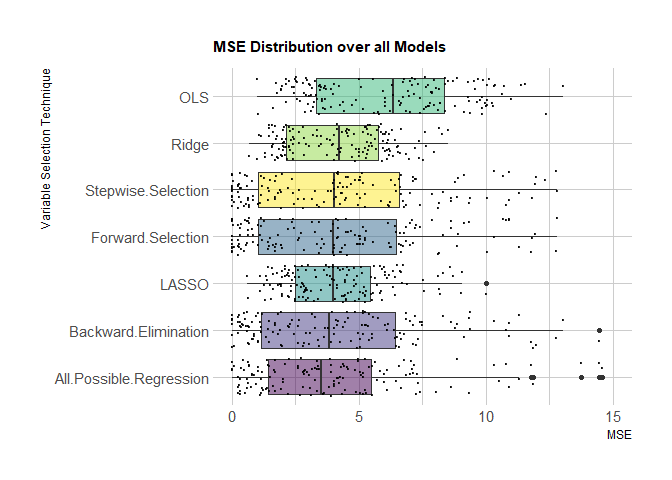
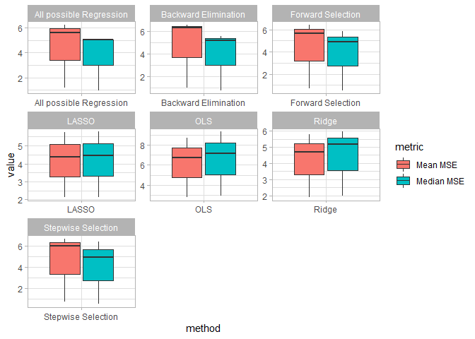

# Introduction

The aims of this project are to simulate multivariate data from underlying linear models with varying degrees of correlation among predictors and then observing how effective different variable selection methods perform on each dataset by fitting a linear regression model with the selected variables. Thus, we first simulate 50 datasets for every underlying model from section 7 of the Paper "Regression Shrinkage and Selection via the Lasso" by Tibshirani (1996). We then fit the models according several variable selection and shrinkage methods. Finally, we use mean and median Mean Square Error to compare performances. The following models will be compared. The immediate next step for this project is to add performance metrics such as AIC and BIC in addition to the mean and median MSE to better capture model performances. I also want to vectorize all loops and generally reduce redudant variable storage where possible.

* Ordinary Least Squares Regression (No Variable Selection)
* LASSO Regression
* Ridge Regression
* All possible Regression
* Forward Selection Regression
* Backward Elimination Regression
* Stepwise Selection


# Simulating Datasets

In this section we simulate data from the four aforementioned underlying models.

## Underlying Model 1

Data from the first underlying model consists of 50 simulated datasets with 20 observations each, from the underlying model as outlined by Tibshirani (1996) we have the model such that $\boldsymbol{\beta}=(3,1.5,0,0,2,0,0,0)^T$ , and $\sigma=3$, and the correlation between $x_i$ and $x_j$ as $\rho^{|i-j|}$ where $\rho=0.5$. Thus, we have the model as

$$
y = \boldsymbol{\beta}^{T}\boldsymbol{x} + \sigma\boldsymbol{\epsilon}
$$
R-Implementation:

```r
# Variable Declarations
n_obs1 <- 20
n_simul1 <-50
p1 <- 8
corr1 <- 0.5
sigma1 <- 3
beta1 <- c(3, 1.5 ,0 ,0 ,2 ,0, 0, 0)

# Simulating The Matrix of Predictors
CovarMat1 <- outer(1:length(beta1), 1:length(beta1), function(i,j){corr1^abs(i-j)})
mean_vect1 <- rep(0,length(beta1))
X_n_simul1 <- list()
for(i in 1:n_simul1){ 
  X_n_simul1[[i]] <- as.matrix(mvrnorm(n = n_obs1,mu = mean_vect1,Sigma =  CovarMat1))
}

# Generate Y
epsilon1 <- rnorm(n_obs1,mean = 0,sd = sigma1)
y_n_simul1 <- list()
for(i in 1:n_simul1){
  y_n_simul1[[i]] <-  X_n_simul1[[i]] %*% beta1 + epsilon1
}
```

## Underlying Model 2

Data from the second underlying model also consists of 50 simulated datasets with 20 observations each with the same model structure as for model 1, but now with parameter values $\beta_{j}=0.85$ for every $j$, and $\sigma=3$, and the correlation between $x_i$ and $x_j$ as $\rho^{|i-j|}$ where $\rho=0.5$.

R-Implementation:

```r
# Variable declarations
n_obs2 <- 20
n_simul2 <-50
p2 <- 8
corr2 <- 0.5
sigma2 <- 3
beta2 <- c(0.85, 0.85, 0.85 ,0.85 ,0.85 ,0.85 ,0.85 ,0.85)

#Simulating Matrix of Predictors
CovarMat2 <- outer(1:length(beta2), 1:length(beta2), function(i,j){corr2^abs(i-j)})
mean_vect2 <- rep(0,length(beta2))
X_n_simul2 <- list()
for(i in 1:n_simul2){ 
  X_n_simul2[[i]] <- as.matrix(mvrnorm(n = n_obs2,mu = mean_vect2,Sigma =  CovarMat2))
}

#Generate Y
epsilon2 <- rnorm(n_obs2,mean = 0,sd = sigma2)
y_n_simul2 <- list()
for(i in 1:n_simul2){
  y_n_simul2[[i]] <-  X_n_simul2[[i]] %*% beta2 + epsilon2
}
```

## Underlying Model 3

Data from the third underlying model also consists of 50 simulated datasets with 20 observations each with the same model structure as for model 1, but now with parameter values $\boldsymbol{\beta}=(5,0,0,0,0,0,0,0)^T$, and $\sigma=2$, and the correlation between $x_i$ and $x_j$ as $\rho^{|i-j|}$ where $\rho=0.5$.

R-Implementation:

```r
# Variable declaration for simulating dataset
n_obs3 <- 20
n_simul3 <-50
p3 <- 8
corr3 <- 0.5
sigma3 <- 2
beta3 <- c(5, 0, 0, 0, 0, 0, 0, 0)

#Simulating matrix of predictors X
CovarMat3 <- outer(1:length(beta3), 1:length(beta3), function(i,j){corr3^abs(i-j)})
mean_vect3 <- rep(0,length(beta3))
X_n_simul3 <- list()
for(i in 1:n_simul3){ 
  X_n_simul3[[i]] <- as.matrix(mvrnorm(n = n_obs3,mu = mean_vect3,Sigma =  CovarMat3))
}

#Generate y from X 

epsilon3 <- rnorm(n_obs3,mean = 0,sd = sigma3)
y_n_simul3 <- list()
for(i in 1:n_simul3){
  y_n_simul3[[i]] <-  X_n_simul3[[i]] %*% beta3 + epsilon3
}
```

# Fitting Models

In this section, we fit the regression models and measure performance for each underlying model

## OLS Regression

We first fit the OLS Regression Model and measure model performances. It is important to mention that no predictors are discarded for OLS Regression. We have the data as $(\boldsymbol{x}^{i},y_i)$ for $i=1,2,...,N$, where $\boldsymbol{x}^{i}=(x_{i1},...,x_{ip})^T$, and according to Garet et al. (2013) we thus estimate $\beta_{0},\beta_{1},...,\beta_{p}$ to minimize

$$
\text{RSS} =  \sum^{n}_{i=1}\left(y_{i}-\beta_{0}-\sum^{p}_{j=1}\beta_{j}x_{ij}\right)^2
$$

R-Implementation:

```r
#Underlying Model 1
OLS_MSE_Data1 <- vector(length = n_simul1)

for(i in 1:n_simul1){
  OLS_fit1 <- lm(y_n_simul1[[i]]~X_n_simul1[[i]])
  OLS_MSE_Data1[i] <-  get_mse(OLS_fit1,var.estimate = FALSE)
}

mean_OLS_MSE_Data1 <- mean(OLS_MSE_Data1)
median_OLS_MSE_Data1 <- median(OLS_MSE_Data1)
OLS_row1 <- cbind("OLS",mean_OLS_MSE_Data1,median_OLS_MSE_Data1)

#Underlying Model 2
OLS_MSE_Data2 <- vector(length = n_simul2)

for(i in 1:n_simul2){
  OLS_fit2 <- lm(y_n_simul2[[i]]~X_n_simul2[[i]])
  OLS_MSE_Data2[i] <-  get_mse(OLS_fit2,var.estimate = FALSE)
}

mean_OLS_MSE_Data2 <- mean(OLS_MSE_Data2)
median_OLS_MSE_Data2 <- median(OLS_MSE_Data2)
OLS_row2 <- cbind("OLS",mean_OLS_MSE_Data2,median_OLS_MSE_Data2)

#Underlying Model 3
OLS_MSE_Data3 <- vector(length = n_simul3)

for(i in 1:n_simul3){
  OLS_fit3 <- lm(y_n_simul3[[i]]~X_n_simul3[[i]])
  OLS_MSE_Data3[i] <-  get_mse(OLS_fit3,var.estimate = FALSE)
}

mean_OLS_MSE_Data3 <- mean(OLS_MSE_Data3)
median_OLS_MSE_Data3 <- median(OLS_MSE_Data3)
OLS_row3 <- cbind("OLS",mean_OLS_MSE_Data3,median_OLS_MSE_Data3)
```

## LASSO Regression

We now fit the LASSO with 10-fold cross-validation, measure model performances, and outline the LASSO technique according to Tibshirani (1996). We have the data as $(\boldsymbol{x}^{i},y_i)$ for $i=1,2,...,N$, where $\boldsymbol{x}^{i}=(x_{i1},...,x_{ip})^T$ and the predictors are standardized. Additionally, we define $\boldsymbol{\hat{\beta}}=(\hat{\beta}_{1},...,\hat{\beta}_{p})^T$ and tuning parameter $t\geq0$ and so the LASSO estimate $(\boldsymbol{\hat{\alpha}},\boldsymbol{\hat{\beta}})$ is defined as

$$
(\boldsymbol{\hat{\alpha}},\boldsymbol{\hat{\beta}})=\text{arg min}\left\{\sum^{N}_{i=1}(y_i-\alpha-\sum_{j}\beta_{j}x_{ij})^2\right\} \text{   subject to } \sum_{j}|\beta_j|\leq t
$$

R-Implementation:

```r
#Underlying Model 1
LASSO_MSE_Data1 <- vector(length = n_simul1)

for(i in 1:n_simul1){
  lasso_fit1 = glmnet(X_n_simul1[[i]], y_n_simul1[[i]], alpha = 1, family="gaussian")
  crossval1 = cv.glmnet(X_n_simul1[[i]], y_n_simul1[[i]],
                       alpha = 1, nfolds = 10,grouped = FALSE)
  lambda1 = crossval1$lambda.min
  y_hat1 = predict(lasso_fit1, s = lambda1, newx = X_n_simul1[[i]])
  LASSO_MSE_Data1[i] <- mean((y_hat1 - y_n_simul1[[i]])^2)
}

mean_LASSO_MSE_Data1 <- mean(LASSO_MSE_Data1)
median_LASSO_MSE_Data1 <- median(LASSO_MSE_Data1)
LASSO_row1 <- cbind("LASSO",mean_LASSO_MSE_Data1, median_LASSO_MSE_Data1)

#Underlying Model 2
LASSO_MSE_Data2 <- vector(length = n_simul2)

for(i in 1:n_simul2){
  lasso_fit2 = glmnet(X_n_simul2[[i]], y_n_simul2[[i]], alpha = 1, family="gaussian")
  crossval2 = cv.glmnet(X_n_simul2[[i]], y_n_simul2[[i]],
                       alpha = 1, nfolds = 10,grouped = FALSE)
  lambda2 = crossval2$lambda.min
  y_hat2 = predict(lasso_fit2, s = lambda2, newx = X_n_simul2[[i]])
  LASSO_MSE_Data2[i] <- mean((y_hat2 - y_n_simul2[[i]])^2)
}

mean_LASSO_MSE_Data2 <- mean(LASSO_MSE_Data2)
median_LASSO_MSE_Data2 <- median(LASSO_MSE_Data2)
LASSO_row2 <- cbind("LASSO",mean_LASSO_MSE_Data2, median_LASSO_MSE_Data2)

#Underlying Model 3
LASSO_MSE_Data3 <- vector(length = n_simul3)

for(i in 1:n_simul3){
  lasso_fit3 = glmnet(X_n_simul3[[i]], y_n_simul3[[i]], alpha = 1, family="gaussian")
  crossval3 = cv.glmnet(X_n_simul3[[i]], y_n_simul3[[i]],
                       alpha = 1, nfolds = 10,grouped = FALSE)
  lambda3 = crossval3$lambda.min
  y_hat3 = predict(lasso_fit3, s = lambda3, newx = X_n_simul3[[i]])
  LASSO_MSE_Data3[i] <- mean((y_hat3 - y_n_simul3[[i]])^2)
}

mean_LASSO_MSE_Data3 <- mean(LASSO_MSE_Data3)
median_LASSO_MSE_Data3 <- median(LASSO_MSE_Data3)
LASSO_row3 <- cbind("LASSO",mean_LASSO_MSE_Data3, median_LASSO_MSE_Data3)
```

## Ridge Regression

We now fit the Ridge with 10-fold cross-validation, measure model performances, and outline the Ridge Regression technique according to Gareth James et al. (2013). Ridge Regression has a similar setup to OLS, although the quantity to be minimized is different than for OLS and LASSO Regression. We define tuning parameter $\lambda \geq 0$, and so we have regression coefficient estimates $\boldsymbol{\hat{\beta}}$ to minimize 

$$
\sum_{i=1}^{n}\left(y_{i}-\beta_{0}-\sum_{j=1}^{p}\beta_{j}x_{ij}\right)^2 + \lambda\sum^{p}_{j=1}\beta^{2}_{j}
$$
R-Implementation:

```r
#Underlying Model 1
Ridge_MSE_Data1 <- vector(length = n_simul1)

for(i in 1:n_simul1){
  Ridge_fit1 = glmnet(X_n_simul1[[i]], y_n_simul1[[i]], alpha = 0, family="gaussian")
  crossval1 = cv.glmnet(X_n_simul1[[i]], y_n_simul1[[i]],
                       alpha = 0, nfolds = 10,grouped = FALSE)
  lambda1 = crossval1$lambda.min
  y_hat1 = predict(Ridge_fit1, s = lambda1, newx = X_n_simul1[[i]])
  Ridge_MSE_Data1[i] <- mean((y_hat1 - y_n_simul1[[i]])^2)
}

mean_Ridge_MSE_Data1 <- mean(Ridge_MSE_Data1)
median_Ridge_MSE_Data1 <- median(Ridge_MSE_Data1)
Ridge_row1 <- cbind("Ridge",mean_Ridge_MSE_Data1,median_Ridge_MSE_Data1)

#Underlying Model 2
Ridge_MSE_Data2 <- vector(length = n_simul2)

for(i in 1:n_simul2){
  Ridge_fit2 = glmnet(X_n_simul2[[i]], y_n_simul2[[i]], alpha = 0, family="gaussian")
  crossval2 = cv.glmnet(X_n_simul2[[i]], y_n_simul2[[i]],
                       alpha = 0, nfolds = 10,grouped = FALSE)
  lambda2 = crossval2$lambda.min
  y_hat2 = predict(Ridge_fit2, s = lambda2, newx = X_n_simul2[[i]])
  Ridge_MSE_Data2[i] <- mean((y_hat2 - y_n_simul2[[i]])^2)
}

mean_Ridge_MSE_Data2 <- mean(Ridge_MSE_Data2)
median_Ridge_MSE_Data2 <- median(Ridge_MSE_Data2)
Ridge_row2 <- cbind("Ridge",mean_Ridge_MSE_Data2,median_Ridge_MSE_Data2)

#Underlying Model 3
Ridge_MSE_Data3 <- vector(length = n_simul3)

for(i in 1:n_simul3){
  Ridge_fit3 = glmnet(X_n_simul3[[i]], y_n_simul3[[i]], alpha = 0, family="gaussian")
  crossval3 = cv.glmnet(X_n_simul3[[i]], y_n_simul3[[i]],
                       alpha = 0, nfolds = 10,grouped = FALSE)
  lambda3 = crossval3$lambda.min
  y_hat3 = predict(Ridge_fit3, s = lambda3, newx = X_n_simul3[[i]])
  Ridge_MSE_Data3[i] <- mean((y_hat3 - y_n_simul3[[i]])^2)
}

mean_Ridge_MSE_Data3 <- mean(Ridge_MSE_Data3)
median_Ridge_MSE_Data3 <- median(Ridge_MSE_Data3)
Ridge_row3 <- cbind("Ridge",mean_Ridge_MSE_Data3,median_Ridge_MSE_Data3)
```

## All Possible Regression

We now fit All Possible Regression Models, measure model performances, and outline the All Possible Regression technique according to Hocking (1976). All Possible Regression is a computationally intensive variable selection technique where given that the number of predictors $t$ is not too large since the number of all possible models is $2^t$, then all possible models will be fit and the model with the best performance will be selected. It is important to mention that Hocking (1976) emphasizes approaches and modifications to All Possible Regression that optimize the procedure for evaluating all possible subsets, which we will not further consider for this project.

R-Implementation:

```r
# Underlying Model 1
All_possible_MSE_Data1 <- list()

for(i in 1:n_simul1){
  sig1 <- allpossible(data.frame(X_n_simul1[[i]]),matrix(y_n_simul1[[i]]))$AIC==1
  All_possible_fit1 <- lm(y_n_simul1[[i]] ~ X_n_simul1[[i]][,sig1]+0)
  b1 = array(0,8)
  b1[sig1] = coef(All_possible_fit1)
  All_possible_MSE_Data1[[i]] <-  t(beta1-b1)%*%CovarMat1%*%(beta1-b1)
}

mean_All_possible_MSE_Data1 <- mean(unlist(All_possible_MSE_Data1))
median_All_possible_MSE_Data1 <- median(unlist(All_possible_MSE_Data1))
All_possible_row1 <- cbind("All possible Regression",
                         mean_All_possible_MSE_Data1,median_All_possible_MSE_Data1)

# Underlying Model 2
All_possible_MSE_Data2 <- list()

for(i in 1:n_simul2){
  sig2 <- allpossible(data.frame(X_n_simul2[[i]]),matrix(y_n_simul2[[i]]))$AIC==1
  All_possible_fit2 <- lm(y_n_simul2[[i]] ~ X_n_simul2[[i]][,sig2]+0)
  b2 = array(0,8)
  b2[sig2] = coef(All_possible_fit2)
  All_possible_MSE_Data2[[i]] <-  t(beta2-b2)%*%CovarMat2%*%(beta2-b2)
}

mean_All_possible_MSE_Data2 <- mean(unlist(All_possible_MSE_Data2))
median_All_possible_MSE_Data2 <- median(unlist(All_possible_MSE_Data2))
All_possible_row2<- cbind("All possible Regression",
                         mean_All_possible_MSE_Data2,median_All_possible_MSE_Data2)

# Underlying Model 3
All_possible_MSE_Data3 <- list()

for(i in 1:n_simul3){
  sig3 <- allpossible(data.frame(X_n_simul3[[i]]),matrix(y_n_simul3[[i]]))$AIC==1
  All_possible_fit3 <- lm(y_n_simul3[[i]] ~ X_n_simul3[[i]][,sig3]+0)
  b3 = array(0,8)
  b3[sig3] = coef(All_possible_fit3)
  All_possible_MSE_Data3[[i]] <-  t(beta3-b3)%*%CovarMat3%*%(beta3-b3)
}

mean_All_possible_MSE_Data3 <- mean(unlist(All_possible_MSE_Data3))
median_All_possible_MSE_Data3 <- median(unlist(All_possible_MSE_Data3))
All_possible_row3<- cbind("All possible Regression",
                         mean_All_possible_MSE_Data3,median_All_possible_MSE_Data3)
```

## Forward Selection

We now fit Forward Selection Regression Models with a cutoff p-value of $0.5$ for the $F$-statistic outlined below, measure model performances, and outline the Forward Selection technnique. According to Hocking (1976) the Forward Selection technique starts with no variables and adds one variable at a time to the equation until either all variables are in or a criteria to stop the technique is satisfied. Furthermore, the variable considered for inclusion at any step is the one yielding the largest F-ratio among the variables being considered for inclusion. Thus, the variable $i$ is added to the equation of $p$-terms if

$$
F_{i} = \underset{i}{\max}\left(\frac{RSS_{p} - RSS_{p+i}}{\hat{\sigma}_{p+i}^2}\right) > F_{in}
$$
R-Implementation:

```r
#Underlying Model 1
forward_MSE_Data1 <- list()

for(i in 1:n_simul1){
  sig1 <- forward(data.frame(X_n_simul1[[i]]),matrix(y_n_simul1[[i]]),"BIC",slentry = 0.5)
  forward_fit1 <- lm(y_n_simul1[[i]] ~ X_n_simul1[[i]][,sig1]+0)
  b1 = array(0,8)
  b1[sig1] = coef(forward_fit1)
  forward_MSE_Data1[[i]] <-   t(beta1-b1)%*%CovarMat1%*%(beta1-b1)
}

mean_forward_MSE_Data1 <- mean(unlist(forward_MSE_Data1))
median_forward_MSE_Data1 <- median(unlist(forward_MSE_Data1))
forward_row1<- cbind("Forward Selection",mean_forward_MSE_Data1,median_forward_MSE_Data1)

#Underlying Model 2
forward_MSE_Data2 <- list()

for(i in 1:n_simul2){
  sig2 <- forward(data.frame(X_n_simul2[[i]]),matrix(y_n_simul2[[i]]),"BIC",slentry = 0.5)
  forward_fit2 <- lm(y_n_simul2[[i]] ~ X_n_simul2[[i]][,sig2]+0)
  b2 = array(0,8)
  b2[sig2] = coef(forward_fit2)
  forward_MSE_Data2[[i]] <-   t(beta2-b2)%*%CovarMat2%*%(beta2-b2)
}

mean_forward_MSE_Data2 <- mean(unlist(forward_MSE_Data2))
median_forward_MSE_Data2 <- median(unlist(forward_MSE_Data2))
forward_row2<- cbind("Forward Selection",mean_forward_MSE_Data2,median_forward_MSE_Data2)

#Underlying Model 3
forward_MSE_Data3 <- list()

for(i in 1:n_simul3){
  sig3 <- forward(data.frame(X_n_simul3[[i]]),matrix(y_n_simul3[[i]]),"BIC",slentry = 0.5)
  forward_fit3 <- lm(y_n_simul3[[i]] ~ X_n_simul3[[i]][,sig3]+0)
  b3 = array(0,8)
  b3[sig3] = coef(forward_fit3)
  forward_MSE_Data3[[i]] <-   t(beta3-b3)%*%CovarMat3%*%(beta3-b3)
}

mean_forward_MSE_Data3 <- mean(unlist(forward_MSE_Data3))
median_forward_MSE_Data3 <- median(unlist(forward_MSE_Data3))
forward_row3<- cbind("Forward Selection",mean_forward_MSE_Data3,median_forward_MSE_Data3)
```

## Backward Elimination

We now fit Backward Elimination Regression Models with a cutoff p-value of $0.1$ for the $F$-statistic outlined below, measure model performances, and outline the Forward Selection technnique. According to Hocking (1976) the Backward Elimination technique starts with all variables and eliminates one variable at a time from the equation until either all variables are out or a criteria to stop the technique is satisfied. Furthermore, the variable considered for exclusion at any step is the one yielding the smallest F-ratio among the variables being considered for exclusion if the F-ratio does not exceed a specified value. Thus, the variable $i$ is removed removed from the equation of $p$-terms if

$$
F_{i} = \underset{i}{\min}\left(\frac{RSS_{p-i} - RSS_{p}}{\hat{\sigma}_{p}^2}\right) < F_{out}
$$
R-Implementation:

```r
#Underlying Model 1
backward_MSE_Data1 <- list()

for(i in 1:n_simul1){
  sig1 <- backward(X_n_simul1[[i]],matrix(y_n_simul1[[i]]),"BIC",slstay = 0.10)
  backward_fit1 <- lm(y_n_simul1[[i]] ~ X_n_simul1[[i]][,sig1]+0)
  b1 = array(0,8)
  b1[sig1] = coef(backward_fit1)
  backward_MSE_Data1[[i]] <-   t(beta1-b1)%*%CovarMat1%*%(beta1-b1)
}

mean_backward_MSE_Data1 <- mean(unlist(backward_MSE_Data1))
median_backward_MSE_Data1 <- median(unlist(backward_MSE_Data1))
backward_row1<- cbind("Backward Elimination",mean_backward_MSE_Data1,
                     median_backward_MSE_Data1)

#Underlying Model 2
backward_MSE_Data2 <- list()

for(i in 1:n_simul2){
  sig2 <- backward(X_n_simul2[[i]],matrix(y_n_simul2[[i]]),"BIC",slstay = 0.10)
  backward_fit2 <- lm(y_n_simul2[[i]] ~ X_n_simul2[[i]][,sig2]+0)
  b2 = array(0,8)
  b2[sig2] = coef(backward_fit2)
  backward_MSE_Data2[[i]] <-   t(beta2-b2)%*%CovarMat2%*%(beta2-b2)
}

mean_backward_MSE_Data2 <- mean(unlist(backward_MSE_Data2))
median_backward_MSE_Data2 <- median(unlist(backward_MSE_Data2))
backward_row2<- cbind("Backward Elimination",mean_backward_MSE_Data2,
                     median_backward_MSE_Data2)

#Underlying Model 3
backward_MSE_Data3 <- list()

for(i in 1:n_simul3){
  sig3 <- backward(X_n_simul3[[i]],matrix(y_n_simul3[[i]]),"BIC",slstay = 0.10)
  backward_fit3 <- lm(y_n_simul3[[i]] ~ X_n_simul3[[i]][,sig3]+0)
  b3 = array(0,8)
  b3[sig3] = coef(backward_fit3)
  backward_MSE_Data3[[i]] <-   t(beta3-b3)%*%CovarMat3%*%(beta3-b3)
}

mean_backward_MSE_Data3 <- mean(unlist(backward_MSE_Data3))
median_backward_MSE_Data3 <- median(unlist(backward_MSE_Data3))
backward_row3<- cbind("Backward Elimination",mean_backward_MSE_Data3,
                     median_backward_MSE_Data3)
```

## Stepwise Selection

We now fit Stepwise Selection Regression Models with an entry cutoff p-value of $0.15$ and a removal cutoff p-value of $0.15$ , measure model performances, and outline the Forward Selection technnique. According to Hocking (1976) the Stepwise Selection technique is a combination of both Forward Selection and Backward Elimination such that variables are added as in Forward Selection, but then after adding a variable, all variables in the equation can be removed as in Backward Eliminination.

R-Implementation:

```r
#Underlying Model 1
stepwise_MSE_Data1 <- list()

for(i in 1:n_simul1){
  sig1 <- stepwise(X_n_simul1[[i]],matrix(y_n_simul1[[i]]),"BIC",slentry=0.15,slstay=0.15)
  stepwise_fit1 <- lm(y_n_simul1[[i]] ~ X_n_simul1[[i]][,sig1]+0)
  b1 = array(0,8)
  b1[sig1] = coef(stepwise_fit1)
   stepwise_MSE_Data1[[i]] <-   t(beta1-b1)%*%CovarMat1%*%(beta1-b1)
}

mean_stepwise_MSE_Data1 <- mean(unlist(stepwise_MSE_Data1))
median_stepwise_MSE_Data1 <- median(unlist(stepwise_MSE_Data1))
stepwise_row1<- cbind("Stepwise Selection",mean_stepwise_MSE_Data1,
                     median_stepwise_MSE_Data1)

#Underlying Model 2
stepwise_MSE_Data2 <- list()

for(i in 1:n_simul2){
  sig2 <- stepwise(X_n_simul2[[i]],matrix(y_n_simul2[[i]]),"BIC",slentry=0.15,slstay=0.15)
  stepwise_fit2 <- lm(y_n_simul2[[i]] ~ X_n_simul2[[i]][,sig2]+0)
  b2 = array(0,8)
  b2[sig2] = coef(stepwise_fit2)
   stepwise_MSE_Data2[[i]] <-   t(beta2-b2)%*%CovarMat2%*%(beta2-b2)
}

mean_stepwise_MSE_Data2 <- mean(unlist(stepwise_MSE_Data2))
median_stepwise_MSE_Data2 <- median(unlist(stepwise_MSE_Data2))
stepwise_row2<- cbind("Stepwise Selection",mean_stepwise_MSE_Data2,
                     median_stepwise_MSE_Data2)

#Underlying Model 3
stepwise_MSE_Data3 <- list()

for(i in 1:n_simul3){
  sig3 <- stepwise(X_n_simul3[[i]],matrix(y_n_simul3[[i]]),"BIC",slentry=0.15,slstay=0.15)
  stepwise_fit3 <- lm(y_n_simul3[[i]] ~ X_n_simul3[[i]][,sig3]+0)
  b3 = array(0,8)
  b3[sig3] = coef(stepwise_fit3)
   stepwise_MSE_Data3[[i]] <-   t(beta3-b3)%*%CovarMat3%*%(beta3-b3)
}

mean_stepwise_MSE_Data3 <- mean(unlist(stepwise_MSE_Data3))
median_stepwise_MSE_Data3 <- median(unlist(stepwise_MSE_Data3))
stepwise_row3<- cbind("Stepwise Selection",mean_stepwise_MSE_Data3,
                     median_stepwise_MSE_Data3)
```

# Results and Discussion
## Performance Metrics


- <span style="color:black; font-weight:bold"> General MSE Results on Underlying Models:</span> As expected OLS performs worst, although it is important to note that LASSO and Ridge have similar mean and median MSE scores, which does seem odd, since the median MSE is more robust to outlying values. We observe that the computational methods perform well concerning mean and median MSE relative to other methods.

Results Table:
<table class="table table-striped" style="margin-left: auto; margin-right: auto;">
 <thead>
<tr>
<th style="border-bottom:hidden" colspan="1"></th>
<th style="border-bottom:hidden; padding-bottom:0; padding-left:3px;padding-right:3px;text-align: center; " colspan="2"><div style="border-bottom: 1px solid #ddd; padding-bottom: 5px; ">Underlying Model 1</div></th>
<th style="border-bottom:hidden; padding-bottom:0; padding-left:3px;padding-right:3px;text-align: center; " colspan="2"><div style="border-bottom: 1px solid #ddd; padding-bottom: 5px; ">Underlying Model 2</div></th>
<th style="border-bottom:hidden; padding-bottom:0; padding-left:3px;padding-right:3px;text-align: center; " colspan="2"><div style="border-bottom: 1px solid #ddd; padding-bottom: 5px; ">Underlying Model 3</div></th>
</tr>
  <tr>
   <th style="text-align:left;"> Method </th>
   <th style="text-align:right;"> Mean MSE </th>
   <th style="text-align:right;"> Median MSE </th>
   <th style="text-align:right;"> Mean MSE </th>
   <th style="text-align:right;"> Median MSE </th>
   <th style="text-align:right;"> Mean MSE </th>
   <th style="text-align:right;"> Median MSE </th>
  </tr>
 </thead>
<tbody>
  <tr>
   <td style="text-align:left;"> OLS </td>
   <td style="text-align:right;"> 8.7021 </td>
   <td style="text-align:right;"> 9.3038 </td>
   <td style="text-align:right;"> 6.7627 </td>
   <td style="text-align:right;"> 7.1273 </td>
   <td style="text-align:right;"> 2.7919 </td>
   <td style="text-align:right;"> 2.9233 </td>
  </tr>
  <tr>
   <td style="text-align:left;"> LASSO </td>
   <td style="text-align:right;"> 5.7634 </td>
   <td style="text-align:right;"> 5.7694 </td>
   <td style="text-align:right;"> 4.3767 </td>
   <td style="text-align:right;"> 4.4545 </td>
   <td style="text-align:right;"> 2.1364 </td>
   <td style="text-align:right;"> 2.1551 </td>
  </tr>
  <tr>
   <td style="text-align:left;"> Ridge </td>
   <td style="text-align:right;"> 5.7658 </td>
   <td style="text-align:right;"> 5.9405 </td>
   <td style="text-align:right;"> 4.6968 </td>
   <td style="text-align:right;"> 5.1682 </td>
   <td style="text-align:right;"> 1.8997 </td>
   <td style="text-align:right;"> 1.9833 </td>
  </tr>
  <tr>
   <td style="text-align:left;"> All possible Regression </td>
   <td style="text-align:right;"> 6.2420 </td>
   <td style="text-align:right;"> 5.0628 </td>
   <td style="text-align:right;"> 5.6460 </td>
   <td style="text-align:right;"> 5.0532 </td>
   <td style="text-align:right;"> 1.1967 </td>
   <td style="text-align:right;"> 0.9683 </td>
  </tr>
  <tr>
   <td style="text-align:left;"> Forward Selection </td>
   <td style="text-align:right;"> 5.6598 </td>
   <td style="text-align:right;"> 4.8876 </td>
   <td style="text-align:right;"> 6.4154 </td>
   <td style="text-align:right;"> 5.8442 </td>
   <td style="text-align:right;"> 0.7225 </td>
   <td style="text-align:right;"> 0.5284 </td>
  </tr>
  <tr>
   <td style="text-align:left;"> Backward Elimination </td>
   <td style="text-align:right;"> 6.5540 </td>
   <td style="text-align:right;"> 5.2066 </td>
   <td style="text-align:right;"> 6.3365 </td>
   <td style="text-align:right;"> 5.5424 </td>
   <td style="text-align:right;"> 1.0221 </td>
   <td style="text-align:right;"> 0.8008 </td>
  </tr>
  <tr>
   <td style="text-align:left;"> Stepwise Selection </td>
   <td style="text-align:right;"> 5.9950 </td>
   <td style="text-align:right;"> 4.8876 </td>
   <td style="text-align:right;"> 6.6494 </td>
   <td style="text-align:right;"> 6.3525 </td>
   <td style="text-align:right;"> 0.7243 </td>
   <td style="text-align:right;"> 0.5284 </td>
  </tr>
</tbody>
</table>


## Plots


- <span style="color:black; font-weight:bold">Plotting General MSE:</span> As expected OLS performs worst, although it is important to note that LASSO and Ridge have similar mean and median MSE scores, which does seem odd, since the median MSE is more robust to outlying values. We observe that the computational methods perform well concerning mean and median MSE relative to other methods.



- <span style="color:black; font-weight:bold"> Plotting Mean and Median MSE by Variable Selection Technique:</span> As expected OLS performs worst, although it is important to note that LASSO and Ridge have similar mean and median MSE scores, which does seem odd, since the median MSE is more robust to outlying values. We observe that the computational methods perform well concerning mean and median MSE relative to other methods.



- <span style="color:black; font-weight:bold"> Plotting Mean and Median MSE by Underlying Model:</span> As expected OLS performs worst, although it is important to note that LASSO and Ridge have similar mean and median MSE scores, which does seem odd, since the median MSE is more robust to outlying values. We observe that the computational methods perform well concerning mean and median MSE relative to other methods.


# References

## Papers
* Tibshirani, R. (1996). Regression Shrinkage and Selection Via the Lasso. Journal of the Royal Statistical Society: Series B (Methodological), 58: 267-288. doi:<!-- -->10.1111/j.251<!-- -->7-6161.1996.tb02080.x

* Hocking, R. (1976). A Biometrics Invited Paper. The Analysis and Selection of Variables in Linear Regression. Biometrics, 32(1), 1-49. doi:<!-- -->10.230<!-- -->7/2529336

## Books
* James, G.; Witten, D.; Hastie, T. & Tibshirani, R. (2013), An Introduction to Statistical Learning: with Applications in R. Springer. doi:<!-- -->10.1007/978-1-4<!-- -->614-7138-7

## R Packages
* glmnet
* knitr
* foreach
* MASS
* rlist
* rmarkdown
* dvmisc
* kableExtra
* ggplot2
* tidyr
* hrbrthemes
* viridis
